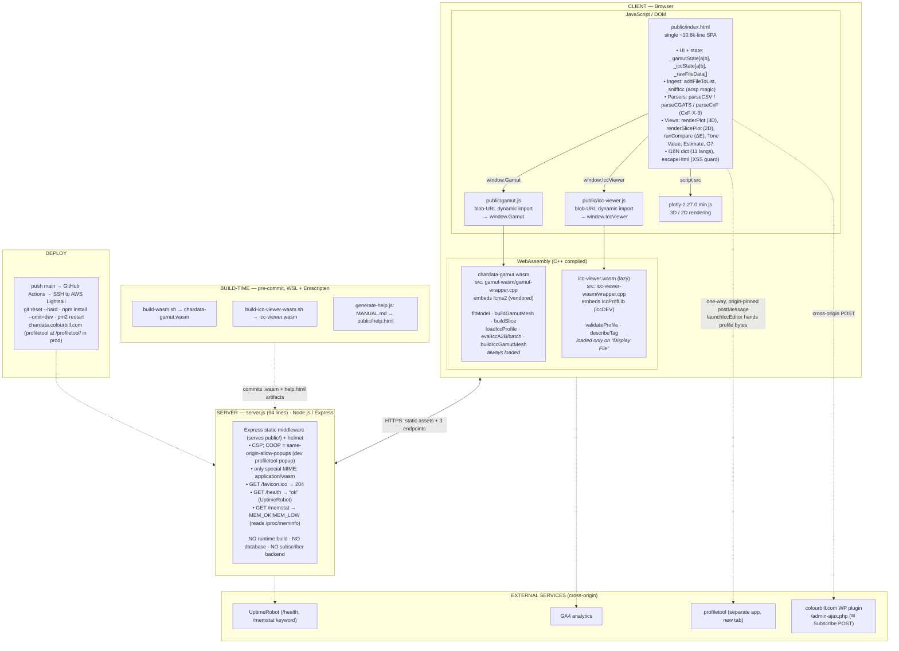

<!-- (c) 2026 William Li -->

# CharData — Architecture

A diagram of CharData's major components, grouped by the environment each runs in
(browser JavaScript, browser WebAssembly, Node.js server, build-time tooling, and
external services). See `docs/architecture.svg` for a rendered version of the same.

## Diagram (Mermaid)

## Component summary by environment

**Browser / JavaScript (the app)**
- `public/index.html` — the entire SPA: UI, two parallel state objects (`_gamutState`
  for characterisation data, `_iccState` for ICC profiles), file ingest/sniffing (CSV,
  CGATS, CxF, ICC), all views (3D plot, 2D slice, Compare, Tone Value, Estimate, G7),
  and the 11-language I18N dictionary. There is no JS build — it is served as-is.
- `public/gamut.js`, `public/icc-viewer.js` — thin loaders that pull the WASM modules
  in via blob-URL dynamic import and expose `window.Gamut` / `window.IccViewer`.
- `plotly-2.27.0.min.js` — vendored rendering library.

**Browser / WebAssembly (C++ compiled)**
- **Module 1 — `chardata-gamut.wasm`** (from `gamut-wasm/gamut-wrapper.cpp`, embeds
  vendored **lcms2**): does all the math — polynomial model fitting, 3D mesh / 2D slice
  generation, and ICC profile A2B evaluation/transforms. Always loaded.
- **Module 2 — `icc-viewer.wasm`** (from `icc-viewer-wasm/wrapper.cpp`, embeds
  **IccProfLib** from iccDEV): ICC header + tag-directory display only. Lazy — loaded
  just on "Display File."

**Server / Node.js**
- `server.js` — a 94-line Express + helmet static file server. Only three live
  endpoints (`/favicon.ico`, `/health`, `/memstat`); no DB, no build step, no app logic.

**Build-time (not running in either env above)**
- Pre-commit hook + `scripts/*` regenerate the two `.wasm` artifacts (WSL + Emscripten)
  and `public/help.html` (from `MANUAL.md`), since Lightsail has no toolchain.

**External (cross-origin)**
- WordPress plugin on `colourbill.com` handles the Subscribe form; GA4 for analytics;
  UptimeRobot watches `/health` and `/memstat`; profiletool (separate app) receives
  profile bytes via one-way origin-pinned `postMessage`.
